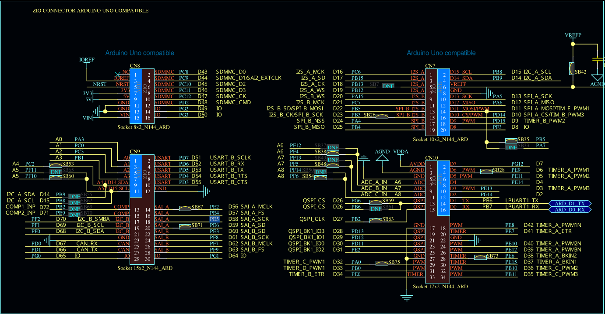

pins on stm32:

new:
| AD2| STM| Func| Pin|
|----|----|----|----|
|D0|PE5|SPI_4_MISO|CN9-18|
|D1|PE4|SPI_4_NSS|CN9-16|
|D2|PE2|SPI_4_CLK|CN9-14|
|D3|PE6|SPI_4_MOSI|CN9-20|
|D5|PG12|GPIO|CN10-2|
|D6|PE9|TIMERA_PWM1|CN10-4|
|D7|PE11|TIMERA_PWM2|CN10-6|

old:

| AD2| STM| Func|
|----|----|----|
|D0|PB4|SPI_B_MISO|
|D1|PA4|SPI_B_NSS|
|D2|PB3|SPI_B_CLK|
|D3|PB5|SPI_B_MOSI|
|D5|PG12|GPIO|
|D6|PE9|TIMERA_PWM1|
|D7|PE11|TIMERA_PWM2|

